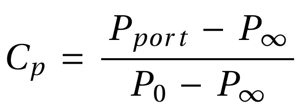

# Procedure:
1. Mount the delta wing model with the tubings in the wind tunnel's test section. 

2. Ensure the model is placed in the proper orientation with no yaw or roll and the angle of attack value of 0 degrees using the digital protractor.

3. Make connections of pressure ports with the input ports of the pressure sensor. Connect different ports (Pport) on the delta wing to the input channels, the pressure port (P∞) at the inlet of the test section to the reference, and the pressure port (P0) at the settling chamber to the input channel. 

4. Change the angle of attack to 15 degrees using the digital protractor.

5. Switch on the wind tunnel motor and take differential pressure readings to estimate the flow velocity. 

6. Ensure that the pressure differential (P0 - P∞) is ≈7.5. For a root chord of 12.5 cm, the freestream Reynolds number is ≈30000.

7. Record differential pressure (Pport - P∞) for each increment of the angle of attack by 5 degrees.

8. Tabulate all the data and calculate the pressure coefficient to plot for comparison.

### Calculation

