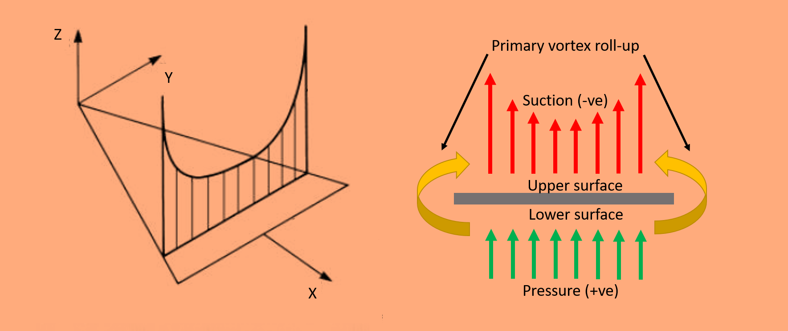
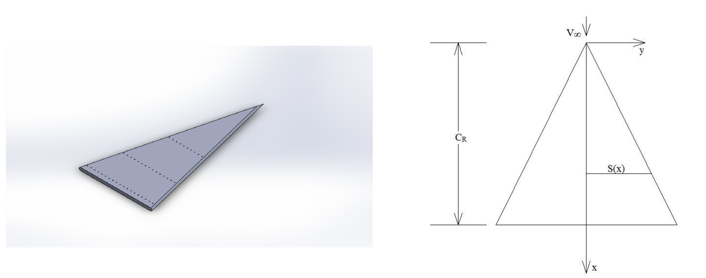

# Theory:

#### Figure 1 Schematic of surface pressure distribution over a delta wing.

The pressure distribution over a delta wing is a complex phenomenon influenced by various factors such as angle of attack, airspeed, and wing geometry. Typically, at moderate angles of attack, the pressure distribution exhibits higher pressures on the lower surface near the apex, gradually decreasing towards the trailing edge, while lower pressures are observed near the leading edge on the upper surface, with a rise in pressure towards the root. Understanding this distribution is crucial for optimizing the aerodynamic performance of delta wings.

One key aspect affecting this distribution is the leading-edge vortex (LEV), a critical aerodynamic phenomenon inherent to delta wings. The LEV plays a significant role in enhancing lift production, particularly at higher angles of attack, through vortex lift. Its presence is characterized by sharp peaks in surface pressure near the leading edge. As the flow progresses downstream, the core of the vortex expands, maintaining coherence until vortex breakdown occurs.

The adverse pressure gradients at higher angles of attack can lead to the flow separation over the wing's upper surface, disrupting the lift generation and stall the wing as well as lead to vortex breakdown. Understanding the behavior of the LEV and its interaction with surface pressure distribution is essential for optimizing delta wing designs and improving their aerodynamic performance.

###### Figure: Delta wing pressure distribution at different chord wise location for AOA=20.1° and β=0° by Verhaagen (Verhaagen, N. and Naarding, S., 1988, June. Experimental and numerical investigation of the vortex flow over a yawed delta wing. In 6th Applied Aerodynamics Conference (p. 2563). https://doi.org/10.2514/6.1988-2563)

In the present experiment, we aim to investigate the surface pressure distribution over a delta wing with an aspect ratio of AR=0.5 for the freestream Reynolds number of approximately 30000 using a pressure measurement instrument and a wind tunnel.

## Apparatus
- Delta wing model
- Pressure measurement device (Scanivalve DSA3217)
- Windtunnel
- Digital protractor

### Delta wing model

#### Figure 2 CAD of the model used for the experiment (Left) and model (Right) schematic.

   

#### Figure 3 Delta wing model with tubings mounted inside the test section of a wind tunnel.

 

A delta wing model with maximum wing span (b) and root chord length (Cr) of  ≈3 cm and 12.5 cm, respectively, is used in the experiment. The planform area (S) is ≈18.75 cm2. Therefore, the aspect ratio (AR= b2/S) is ≈0.5. The model's thickness is 0.5 cm, and the edges are blunt. The model is tethered to a sting placed in the test section, attached to a mounting mechanism that can attain any required attack angle. The model has pressure ports in a spanwise direction (S(x)) at three different locations: x/Cr = 0.5 (10 ports), x/Cr = 0.75 (15 ports), and x/Cr = 0.95 (19 ports).

### Wind Tunnel

 

#### Figure 4 Windtunnel with Settling chamber, Honeycomb, and Entrance highlighted.

#### Figure 5 Windtunnel with Diffuser, Test-section, VFD, and Contraction cone highlighted.

 

An open return low subsonic suction-type atmospheric wind tunnel generates the flow in which the model will be mounted. Wind tunnel components are a honeycomb section, a settling chamber, a contraction cone, a test section, a diffuser, a suction fan, and a motor. The air from the atmosphere enters the tunnel through the honeycomb section. Honeycomb reduces the turbulence from the atmosphere by breaking down the disturbances and stretching the flow due to its structure. The flow then goes through the settling chamber with two wire meshes, further reducing incoming turbulence. The settling chamber has a large volume, which further dissipates any disturbances. The contraction cone increases the velocity by reducing area at the expense of pressure. The wind tunnel has two pressure tapings: one at the settling chamber, which gives stagnation or total pressure, and the second at the end of the contraction cone, which gives static pressure. The difference in these two pressures is used to calculate the inlet velocity of the test section. The test section is a constant cross-section area where we achieve a one-dimensional, steady, and uniform flow. Models are mounted in this part for the test. Diffuser has two functions: one, it reduces the velocity and increases the pressure leading to the suction fan, which results in less work required by the fan; and two, it provides a gradual decrease in velocity or increase in pressure after the test section, which prevents any flow separation and backflow. The suction fan creates the necessary pressure difference required to maintain the airflow. The fan is run by the motor, which can run at different rpm to create a range of velocity. The rpm of the motor is controlled by a variable frequency drive (VFD). 

### Electronic pressure measurement instrument

#### Figure 6 Schematic of pressure measurement system.

An electronic pressure measurement instrument is used to measure pressure over the model. Here, we have used a Scanivalve-made digital sensor array (DSA 3217); it has 16 temperature-compensated piezoresistive sensors with a pneumatic calibration valve, RAM, 16-bit A/D converter, and a microprocessor in a compact, self-contained module. It outputs pressure values in the user-defined engineering unit directly. We can measure 16 pressures simultaneously using this device. It uses an Ethernet connection for communication with any computer.

### Data acquisition system
To operate DSA, a manufacturer-provided software DSALink is required. The software is run using a computer, where a user defines the necessary parameters like data rate, number of samples, and engineering unit. DSA is connected to a computer via Ethernet using TCP/IP protocol.

